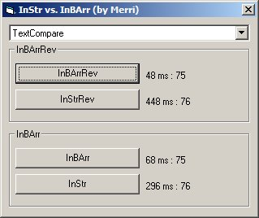



## InBArr and InBArrRev \- searching strings from a byte array

### Description

This code seeks from the end of a byte array trying to find a matching text. Why? Well, handling byte arrays is much faster than handling strings. So, if you needed to parse data real fast and a lot, it would be benefical to do it using a byte array instead of a string.

My starting point to this was rather simple: do the search faster than InStr and InStrRev. Beating the latter was easy: InStrRev isn't of the fastest build-in functions in VB. With InStr I had to taste half of a defeat: it just is superb when it can search in BinaryCompare. But, what if we wanted to do TextCompare? Well, there InBArr and InBArrRev beat real badly both InStr and InStrRev!

Anyways, I hope somebody finds this submission helpful. I'm sorry I didn't comment the code as well as I could/should have, but I hope it doesn't matter as the code should be rather flawless on what it does :) Comments and votes welcome, as always!
 
### More Info
 

             |
---                |---
**Submitted On**   |2004-08-16 17:06:36
**By**             |[Vesa Piittinen](https://github.com/Planet-Source-Code/PSCIndex/blob/master/ByAuthor/vesa-piittinen.md)
**Level**          |Advanced
**User Rating**    |5.0 (15 globes from 3 users)
**Compatibility**  |VB 6\.0
**Category**       |[Miscellaneous](https://github.com/Planet-Source-Code/PSCIndex/blob/master/ByCategory/miscellaneous__1-1.md)
**World**          |[Visual Basic](https://github.com/Planet-Source-Code/PSCIndex/blob/master/ByWorld/visual-basic.md)
**Archive File**   |[InBArr\_and1782538162004\.zip](https://github.com/Planet-Source-Code/vesa-piittinen-inbarr-and-inbarrrev-searching-strings-from-a-byte-array__1-55606/archive/master.zip)

